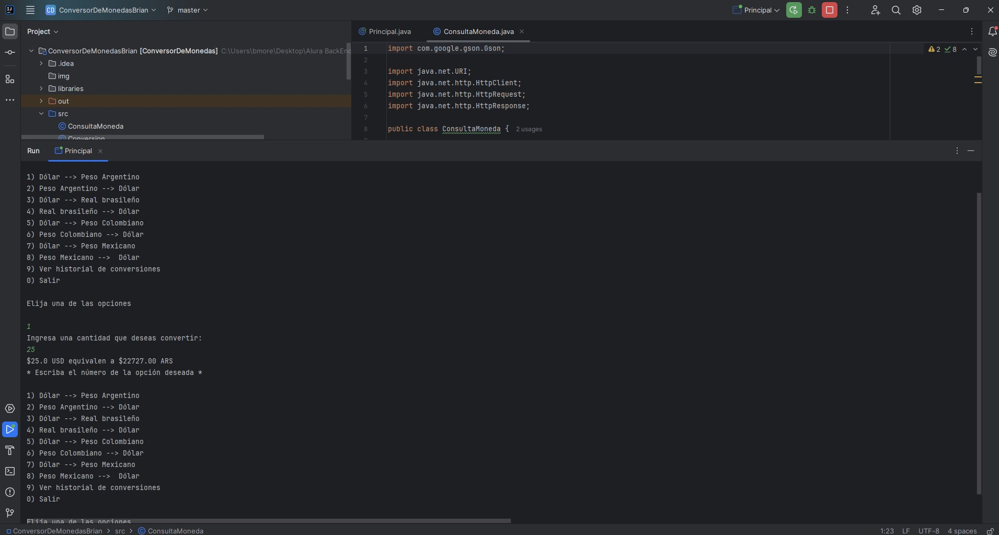
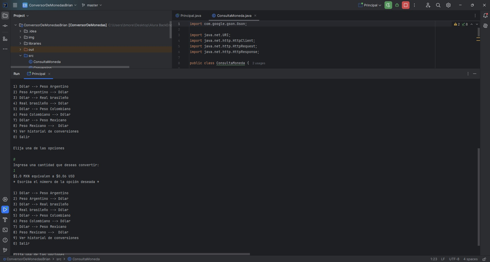

# Superconversor de Monedas

¡Bienvenidos al Superconversor de Monedas! Esta aplicación en Java te permite realizar conversiones entre diversas monedas y gestionar un historial detallado de tus transacciones. Con ayuda de APIs que nos permiten hacer las conversiones actualizadas.

## Funcionalidades

- Conversión entre diferentes pares de monedas:
  - Dólar a Peso Argentino
  - Peso Argentino a Dólar
  - Dólar a Real Brasileño
  - Real Brasileño a Dólar
  - Dólar a Peso Colombiano
  - Peso Colombiano a Dólar
- Visualización del historial de conversiones
- Almacenamiento automático del historial en un archivo de texto

## Resumen de Funcionamiento

El Superconversor de Monedas es una aplicación de consola que interactúa con una API de tipos de cambio para realizar conversiones precisas entre monedas internacionales. Los usuarios seleccionan el par de monedas deseado, ingresan la cantidad a convertir y obtienen el resultado instantáneamente. Además, el programa mantiene un registro de las últimas 30 conversiones realizadas, visible para consulta y guardado para referencia futura.

## Requisitos

- Java 11 o superior
- Maven

## Evidencia

1. Ejecuta la aplicación con el siguiente comando:

2. A continuación capturas de ejecución:

